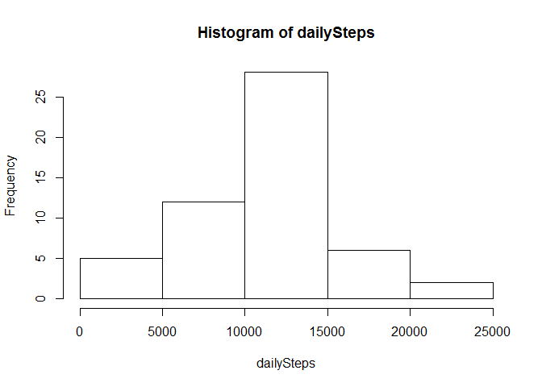
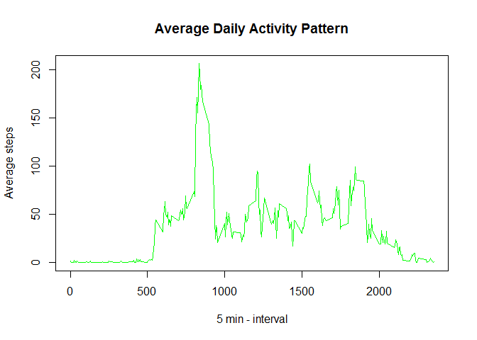
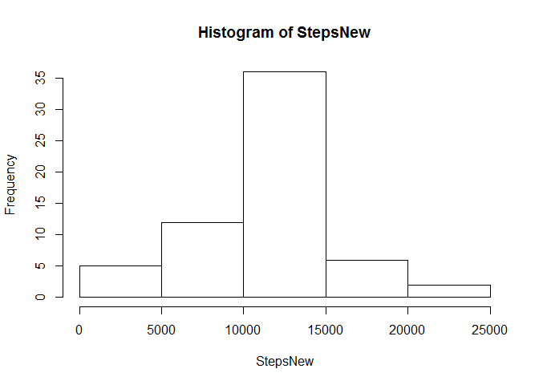
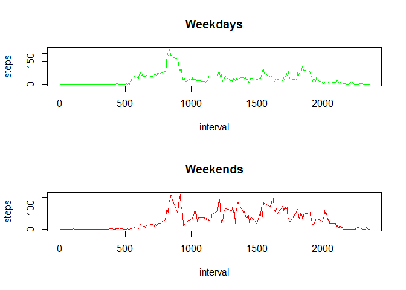

# Reproducible Research: Peer Assessment 1


## Loading and preprocessing the data


```r
activity <- read.csv("E:\\Coursera\\D3\\activity.csv")
summary(activity)
```

```
##      steps                date          interval     
##  Min.   :  0.00   2012-10-01:  288   Min.   :   0.0  
##  1st Qu.:  0.00   2012-10-02:  288   1st Qu.: 588.8  
##  Median :  0.00   2012-10-03:  288   Median :1177.5  
##  Mean   : 37.38   2012-10-04:  288   Mean   :1177.5  
##  3rd Qu.: 12.00   2012-10-05:  288   3rd Qu.:1766.2  
##  Max.   :806.00   2012-10-06:  288   Max.   :2355.0  
##  NA's   :2304     (Other)   :15840
```

## What is mean total number of steps taken per day?

Make a histogram of the total number of steps taken each day


```r
dailySteps <- aggregate(steps ~ date, activity, sum)$steps

hist(dailySteps)
```

 

Calculate and report the mean and median total number of steps taken per day

Mean 

```r
mean(dailySteps,na.rm = TRUE)
```

```
## [1] 10766.19
```
Median 

```r
median(dailySteps,na.rm = TRUE)
```

```
## [1] 10765
```
## What is the average daily activity pattern?

Make a time series plot (i.e. type = "l") of the 5-minute interval (x-axis) and the average number of steps taken, averaged across all days (y-axis)


```r
stepsInterval <- aggregate(steps ~ interval, activity, mean)
plot(stepsInterval$interval, stepsInterval$steps, type="l", xlab = "5 min - interval", ylab = "Average steps", main = "Average Daily Activity Pattern", col = "green")
```

 

```r
stepsInterval$interval[which.max(stepsInterval$steps)]
```

```
## [1] 835
```
Across all the days in the dataset on average, the 5-minute interval contains the maximum number of steps is 8:35 am.

## Imputing missing values
Calculate the total number of missing values in the dataset:

```r
sum(!complete.cases(activity))
```

```
## [1] 2304
```
Use the mean for the 5-minute interval for missing values


```r
newAct = activity
len1 = nrow(newAct)
len2 = nrow(stepsInterval)
for (i in 1:len1) {
  if (is.na(newAct$steps[i])) {
    for (j in 1:len2) {
      if (newAct$interval[i] == stepsInterval[j, 1]) {
        newAct$steps[i] = stepsInterval[j, 2]
      }
    } 
  }    
}
summary(newAct)
```

```
##      steps                date          interval     
##  Min.   :  0.00   2012-10-01:  288   Min.   :   0.0  
##  1st Qu.:  0.00   2012-10-02:  288   1st Qu.: 588.8  
##  Median :  0.00   2012-10-03:  288   Median :1177.5  
##  Mean   : 37.38   2012-10-04:  288   Mean   :1177.5  
##  3rd Qu.: 27.00   2012-10-05:  288   3rd Qu.:1766.2  
##  Max.   :806.00   2012-10-06:  288   Max.   :2355.0  
##                   (Other)   :15840
```
Plot

```r
StepsNew = tapply(newAct$steps, newAct$date, sum)
hist(StepsNew)
```

 

Mean : 


```r
meanStepsNew= mean(StepsNew, na.rm = TRUE)
meanStepsNew
```

```
## [1] 10766.19
```
Median:

```r
medianStepsNew = median(StepsNew, na.rm = TRUE)
medianStepsNew
```

```
## [1] 10766.19
```
total number of steps taken per day is 10766.19, which is the same as that of the original dataset with missing value removed. 
Median is 10766.19 , which is different from the median calculated from the original dataset. 

Adding  2304 values moves median  towards  mean

## Are there differences in activity patterns between weekdays and weekends?

```r
newAct$day <- as.POSIXlt(newAct$date)$wday
newAct$dayType <- as.factor(ifelse(newAct$day == 0 | newAct$day == 6, "weekend", "weekday"))
newAct <- subset(newAct, select = -c(day))

head(newAct)
```

```
##       steps       date interval dayType
## 1 1.7169811 2012-10-01        0 weekday
## 2 0.3396226 2012-10-01        5 weekday
## 3 0.1320755 2012-10-01       10 weekday
## 4 0.1509434 2012-10-01       15 weekday
## 5 0.0754717 2012-10-01       20 weekday
## 6 2.0943396 2012-10-01       25 weekday
```

```r
weekdaysData <- newAct[newAct$dayType == "weekday",]
weekendsData <- newAct[newAct$dayType == "weekend",]
stepsIntervalWeekdays <- aggregate(steps ~ interval, weekdaysData, mean)
stepsIntervalWeekends <- aggregate(steps ~ interval, weekendsData, mean)

par(mfrow = c(2, 1))

plot(stepsIntervalWeekdays, type = "l", col = "green", main = "Weekdays")
plot(stepsIntervalWeekends, type = "l", col = "red", main = "Weekends")
```

 

Comparing time series plots, there are obvious differences in activity patterns between weekdays and weekends. Weekdays there is a clear peak in the morning.
